# ESPHome 電子紙範例

此專案包含多種 ESPHome 配置範例，適用於不同的電子紙顯示器。以下為各範例的說明

## [dashboard.yaml](dashboard.yaml)
顯示 Home Assistant 設備狀態、感測器數值、天氣資訊、異常警示，分級事件的刷新控制，25 類事件，每天刷新次數約 80 次，含全刷新(閃爍) 2-3 次

**注意事項：**
- 適用有局部刷新功能的電子紙

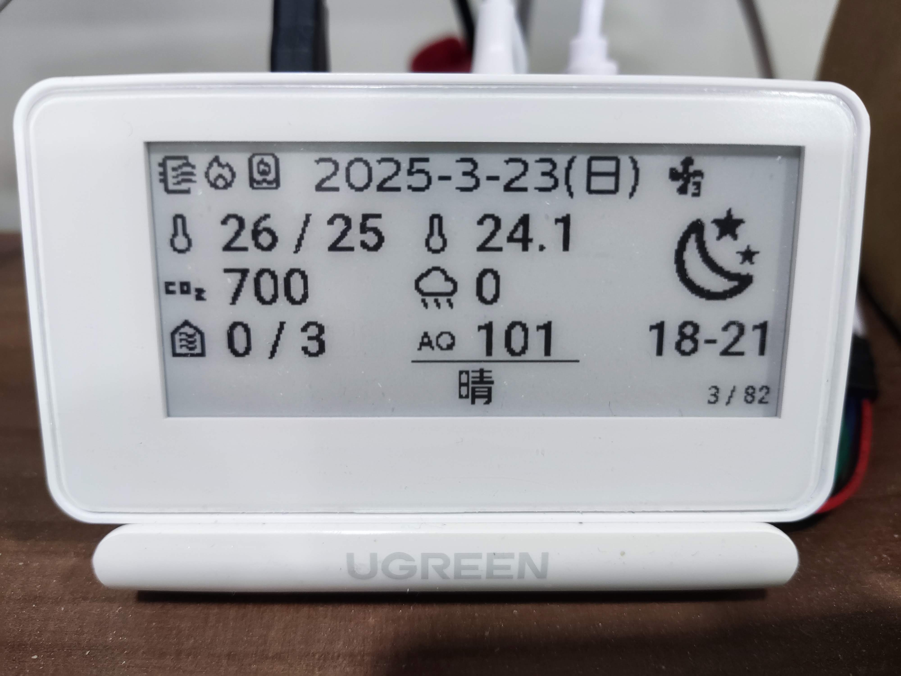

## [clock.yaml](clock.yaml)
顯示日期與即時時間，每六小時連網校正時間。在深度睡眠模式下一顆 18650 電池供電，約可運行 20 天，28800 次刷新

**注意事項：**
- 適用有局部刷新功能的電子紙
- ESP32 內建的 RTC 時鐘需定期校正，否則會有較大時間偏差，深度睡眠模式下時間偏差更多
- 在深度睡眠模式下，USB 與電腦的通訊會中斷，清醒週期內可以進行韌體燒錄，或是按鍵控制 Bootloader 至下載模式
  - 清醒週期於第 55 秒至第 5 秒，或在重新連接 USB 後到第 5 秒內

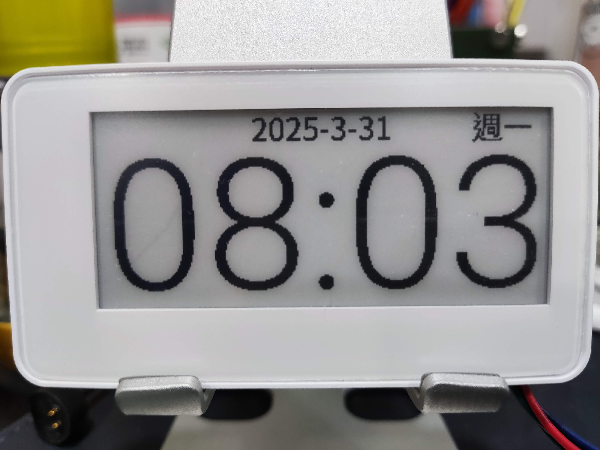

## `wordpad.yaml`
顯示 Home Assistant 自訂的 `input_text` enity state，字體大小為 20px 時，2.9吋螢幕約可顯示 84 個中文字或 156 個英數字

**注意事項：**
- 適用有局部刷新功能的電子紙
- Home Assistant 的 entity state 最多 255 字元(不分中英文)，input_text 功能為單行輸入與顯示
  - 產生的長文可放 entity attribute
- ESPHome 的 Text Componet 支援最多 255 bytes（英數字佔 1 byte，中文字佔 3-4 bytes）
- 大量字體轉為圖型會佔用大量 Flash 空間，特別是大尺寸中文字。解決方法：
  - 減少字體數量或縮小字體大小
  - 使用具有較大 Flash 容量的開發板（8MB 或以上）
  - 移除 OTA 分區（停用 OTA 後只能透過有線方式燒錄韌體）

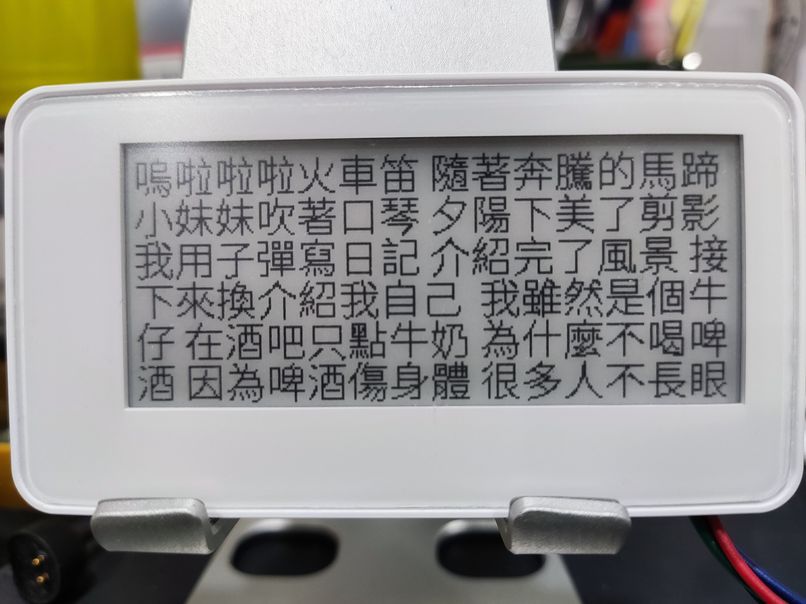

## [calendar.yaml](calendar.yaml)
顯示當月日曆與今日日期

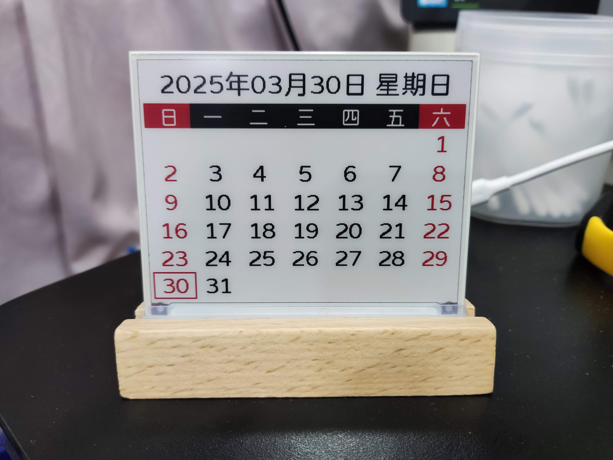

## [digital-photo-frame.yaml](digital-photo-frame.yaml)
展示經 Floyd-Steinberg 演算法處理的圖片，並透過 ESPHome 的 Online Image 下載隨機 webp 格式的隨機圖片庫，與其他影像調整功能

**注意事項：**
- 開發板需要有 PSRAM，影像大小需做限制
- Online Image 有支援多種影像格式，各別限制條件請[詳閱文件](https://esphome.io/components/online_image.html)
- 此範例穩定性很差，圖片下載與影像解碼階段會頻繁崩潰

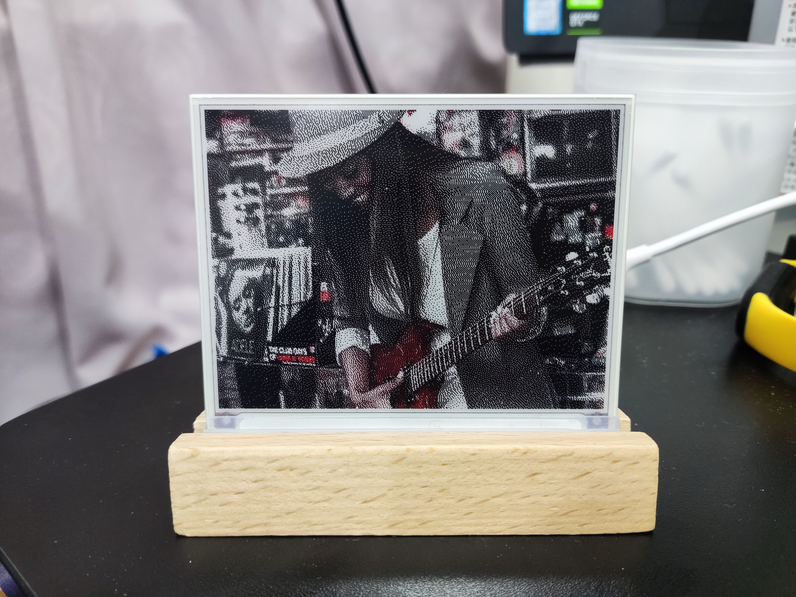
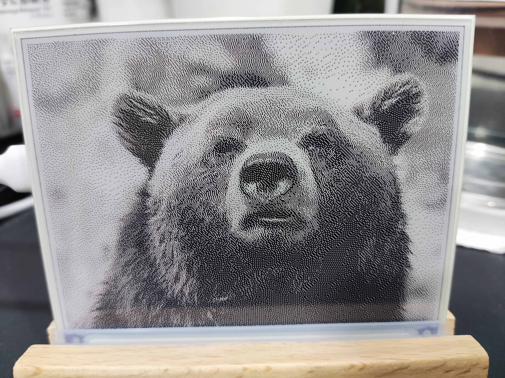
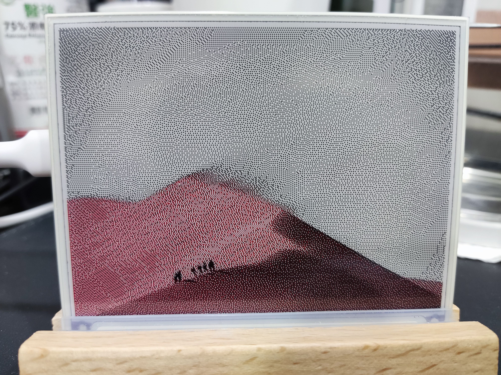
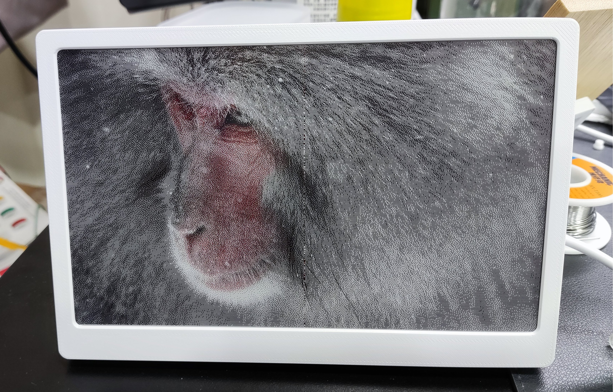

## [notion-database-viewer](https://github.com/parkghost/esphome-notion-database/tree/main/examples/notion-database-viewer)
顯示 Notion Database 數據的通用工具

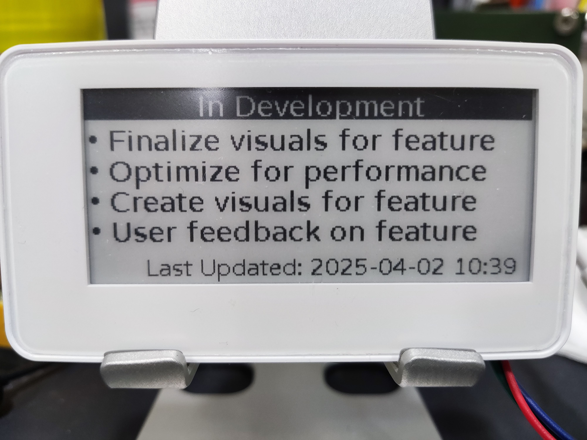
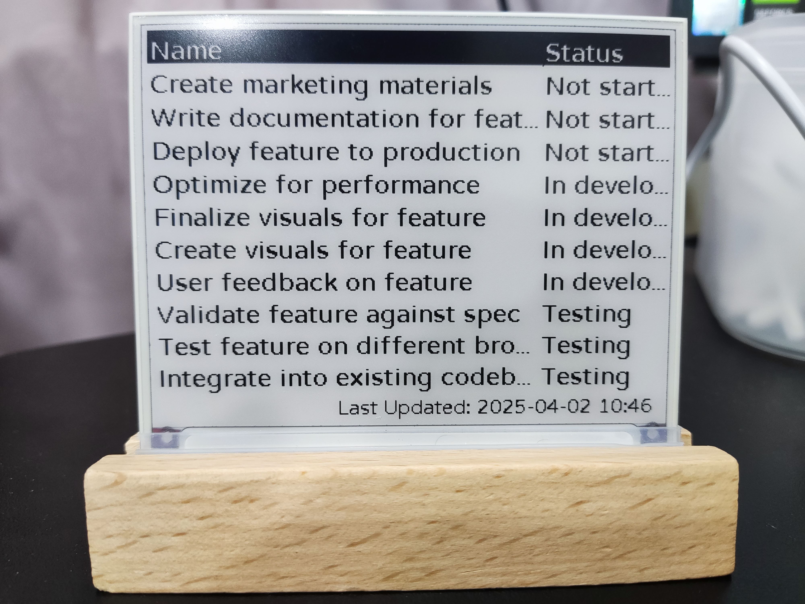
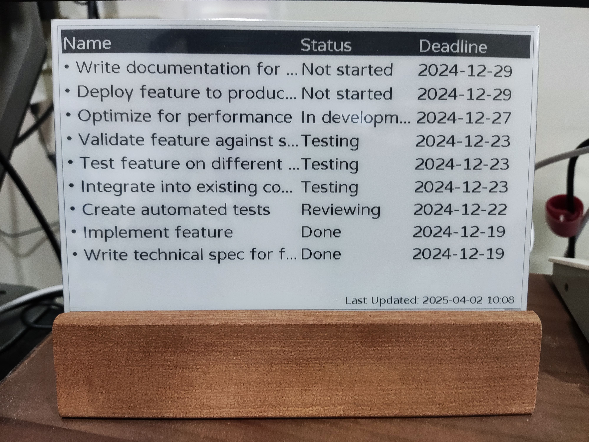

## 參考資料
- [ESPhome Waveshare E-Paper Display](https://esphome.io/components/display/waveshare_epaper.html)
- [More ESPhome E-Paper Driver](https://github.com/parkghost/esphome-epaper)
- [ESPhome Display Components](https://esphome.io/components/#display-components)
- [ESPhome Home Assistant Sensor](https://esphome.io/components/sensor/homeassistant)
- [ESPhome Home Deep Sleep](https://esphome.io/components/deep_sleep.html)
- [電子紙Q&A](https://www.good-display.cn/news/68.html)
- [電子紙顯示器使用指南](https://www.good-display.cn/news/69.html)